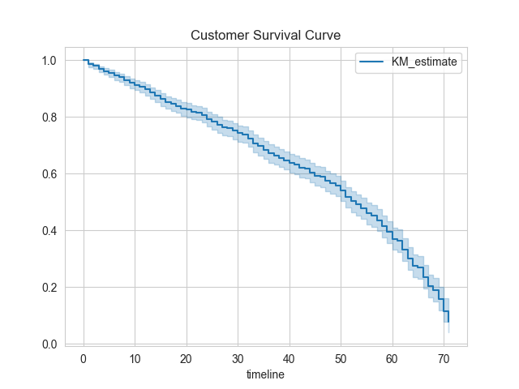
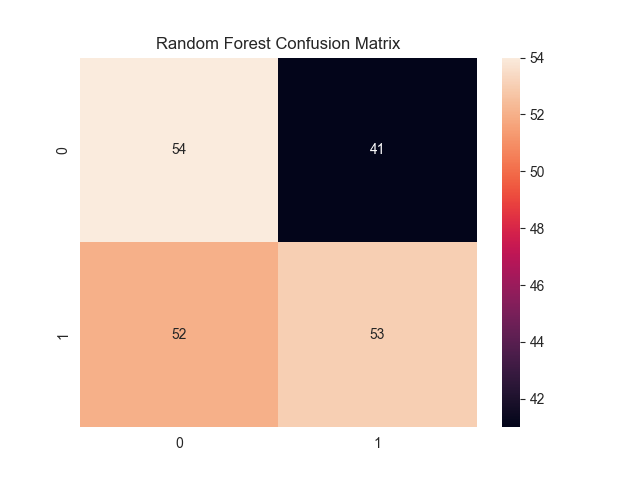

# 📊 Customer Churn Prediction & Survival Analysis

## 🚀 Overview

Customer churn is a major challenge for subscription-based businesses. This project combines **machine learning and survival analysis** to predict churn and understand customer retention behavior over time.

The objective is not only to identify *who* is likely to churn, but also *when* they are likely to leave.

---

## 🎯 Key Highlights

* Achieved **89.5% accuracy** using a Random Forest model
* Applied **Kaplan-Meier estimator** to analyze customer survival probability
* Used **Cox Proportional Hazards model** to quantify churn risk factors
* Built an **end-to-end data analysis pipeline** from preprocessing to insights

---

## 📊 Key Insights

* **Customer tenure** is the strongest predictor of retention
* **Higher monthly charges** are associated with increased churn risk
* Churn probability is highest in the **early stages of customer lifecycle**
* Survival analysis reveals patterns not captured by traditional ML models

---

## 🛠️ Tech Stack

* Python
* Pandas, NumPy
* Scikit-learn
* Lifelines
* Matplotlib, Seaborn

---

## 📈 Outputs

* Churn prediction model
* Survival curves for customer retention
* Confusion matrix and classification metrics
* Feature importance insights

  ## 📈 Visual Insights

### Survival Curve
The Kaplan-Meier curve below shows the probability of a customer staying with the company over time.


### Model Evaluation
The confusion matrix shows our Random Forest's ability to distinguish between loyal and churning customers.


---

## 📂 Project Structure

```
customer-churn-survival-analysis/
├── data/
├── notebooks/
├── images/
├── results/
└── README.md
```

---

## 💡 Business Impact

This project demonstrates how data-driven approaches can:

* Identify high-risk customers
* Improve retention strategies
* Support decision-making with predictive insights

  -----
  
## 📂 File Structure
* `churn_analysis.ipynb`: The complete end-to-end data science pipeline.
* `telco_churn.csv`: Raw customer data.
* `model_predictions.csv`: Output of the Random Forest model for business use.

## 📝 How to Use
1. Clone the repo: `git clone https://github.com/ALAI246/customer-churn-survival-analysis.git`
2. Install dependencies: `pip install -r requirements.txt`
3. Run the Jupyter Notebook to see the step-by-step analysis.
---

## 👨‍💻 Author

**Reagan Alai  Omondi**
Data Analyst | Machine Learning | Survival Analysis

